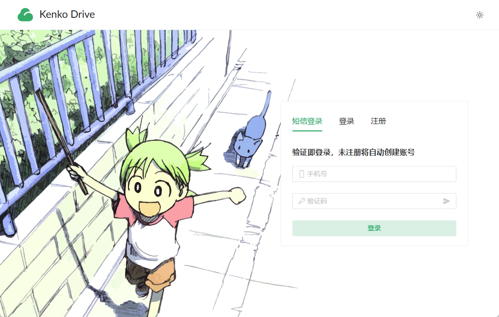

# KenkoDrive 我的云盘

一个基于 `SpringBoot 3.2`、`Spring Security`、`Gradle 8.7` 和 `JPA` ，使用 `Kotlin` 编写的 Web 云盘应用单体后端。
项目整体结构清晰，职责明确，注释全面，开箱即用。

> [!IMPORTANT]
> 该项目仅为个人学习项目，不具备商业使用价值，仅供学习交流。
> 如果你需要一款类似的软件，不妨看看[alist](https://github.com/alist-org/alist)。

> [!CAUTION]
> 该项目仍处于初期开发阶段，数据库结构将会频繁变动，不建议在生产环境中使用，请注意备份数据。

|      相关       |                                                                          链接                                                                          |
|:-------------:|:----------------------------------------------------------------------------------------------------------------------------------------------------:|
|   GitHub仓库    |                                       [github.com/AkagiYui/KenkoDrive](https://github.com/AkagiYui/KenkoDrive)                                       |
| GitLink中国大陆仓库 |                                   [gitlink.org.cn/AkagiYui/KenkoDrive](https://gitlink.org.cn/AkagiYui/KenkoDrive)                                   |
|    在线演示地址     | [drive.akagiyui.com](https://drive.akagiyui.com) |
|    API 文档     |                                                [kenkodrive.apifox.cn](https://kenkodrive.apifox.cn/)                                                 |
|     前端仓库      |                [KenkoDriveVue](https://github.com/AkagiYui/KenkoDriveVue) / [中国大陆镜像仓库](https://gitlink.org.cn/AkagiYui/KenkoDriveVue)                |

## 预览图

## 业务功能一览

- [x] 用户(邮箱)注册；(短信/用户名/邮箱)登录
- [x] 个人信息设置、头像上传、密码重置
- [x] 文件(夹)上传/下载/删除
- [ ] 文件分享
- [ ] 游客广场
- [x] 管理员用户管理
- [ ] 管理员文件管理
- [ ] 文件搜索
- [ ] 文件内容检索
- [ ] 照片地理位置统计
- [ ] 用户登录地理位置统计
- [ ] 文件类型统计
- [ ] 流量统计
- [ ] 在线解压
- [ ] 批量打包下载
- [ ] 敏感内容审查
- [ ] (图片、视频、音频封面)缩略图生成
- [ ] 系统告警通知
- [ ] 第三方登录
- [ ] 增值服务
- [ ] 回收站
- [ ] 文件收藏
- [ ] 大文件清理
- [ ] 重复文件清理
- [ ] 文档在线编辑
- [ ] 图片内容识别
- [ ] 离线下载
- [ ] 文件同步
- [ ] 文件版本管理
- [ ] 文档协作

### 文件快递柜

- [ ] 匿名分享：无需注册，直接分享
- [ ] 支持多种类型：文本，图片，文件
- [ ] 随机取件码生成
- [ ] 自定义次数、有效期

## 相关技术一览

- [x] [请求频率限制(注解 + 令牌桶)](app/src/main/kotlin/com/akagiyui/drive/component/limiter/FrequencyLimitAspect.kt)
- [x] [下载速度限制](app/src/main/kotlin/com/akagiyui/common/BucketManager.kt)
- [x] [异步任务](app/src/main/kotlin/com/akagiyui/drive/service/MailService.kt)
- [x] [邮件发送](app/src/main/kotlin/com/akagiyui/drive/service/MailService.kt)
- [x] [参数校验](app/src/main/kotlin/com/akagiyui/drive/model/request/user/AddUserRequest.kt)
- [x] [权限校验](app/src/main/kotlin/com/akagiyui/drive/model/Permission.kt)
- [x] [统一 JSON 格式返回](app/src/main/kotlin/com/akagiyui/common/ResponseResult.kt)
- [ ] [日志记录](app/src/main/kotlin/com/akagiyui/drive/component/DatabaseLogAppender.kt)
- [x] [速度限制、流量限制](app/src/main/kotlin/com/akagiyui/drive/controller/FileController.kt)
- [x] 验证码(CAPTCHA): [图片验证码](app/src/main/kotlin/com/akagiyui/drive/service/CaptchaService.kt)、
  [极验行为验证码](app/src/main/kotlin/com/akagiyui/drive/component/captcha/GeetestCaptchaV4Aspect.kt)
- [x] 一次性密码(OTP): [邮箱验证码](app/src/main/kotlin/com/akagiyui/drive/service/impl/MailServiceImpl.kt)、
  [阿里云短信验证码](app/src/main/kotlin/com/akagiyui/drive/service/impl/SmsServiceImpl.kt)
- [x] [断点续传](app/src/main/kotlin/com/akagiyui/drive/controller/FileController.kt)
- [ ] [分片上传](app/src/main/kotlin/com/akagiyui/drive/service/UploadService.kt)
- [x] [分片下载](app/src/main/kotlin/com/akagiyui/drive/controller/FileController.kt)
- [ ] 文件秒传
- [x] [相同文件合并(上传时检测)](app/src/main/kotlin/com/akagiyui/drive/service/impl/UploadServiceImpl.kt)
- [x] [Gotify 消息推送](app/src/main/kotlin/com/akagiyui/common/notifier/GotifyPusher.kt)
- [x] [定时任务](app/src/main/kotlin/com/akagiyui/drive/task/CronTasks.kt)
- [ ] OAuth2.0
- [ ] 对接支付宝
- [ ] Gravatar / Cravatar 头像

## 技术栈

- [x] [Gradle 包管理](build.gradle.kts)
- [x] [Spring Boot 3.2](app/src/main/kotlin/com/akagiyui/drive/KenkoDriveApplication.kt)
- [x] [Spring Security（跨域与认证授权）](app/src/main/kotlin/com/akagiyui/drive/config/SecurityConfig.kt)
- [x] MySQL 数据库
- [x] [Spring Cache 缓存](app/src/main/kotlin/com/akagiyui/drive/config/CacheConfig.kt)
- [x] [Caffeine 本地缓存](app/src/main/kotlin/com/akagiyui/drive/config/CacheConfig.kt)
- [x] [Redis 缓存](app/src/main/kotlin/com/akagiyui/drive/component/RedisCache.kt)
- [ ] [多级缓存](https://github.com/pig-mesh/multilevel-cache-spring-boot-starter)
- [x] [JWT 鉴权](app/src/main/kotlin/com/akagiyui/common/token/TokenTemplate.kt)
- [x] [Docker 容器化部署](docker-compose.yaml)
- [x] [Drone CI/CD 自动化部署](.drone.yml)
- [x] [JPA ORM 框架](app/src/main/kotlin/com/akagiyui/drive/repository)
- [x] AOP 切面：[频率控制](app/src/main/kotlin/com/akagiyui/drive/component/limiter/FrequencyLimitAspect.kt)、
  [权限校验](app/src/main/kotlin/com/akagiyui/drive/component/permission/PermissionCheckAspect.kt)、
  [请求日志](app/src/main/kotlin/com/akagiyui/drive/component/RequestLogAspect.kt)
- [x] [ApiFox 在线 API 文档](#kenkodrive-我的云盘)
- [x] [Minio 对象存储](app/src/main/kotlin/com/akagiyui/drive/config/MinioConfig.kt)
- [ ] 阿里云 OSS 对象存储
- [ ] WebDAV
- [ ] 搜索引擎
- [x] 事务管理
- [x] [WebSocket](app/src/main/kotlin/com/akagiyui/drive/controller/persist/MemoryWebSocketHandler.kt)
- [x] [SSE(Server-Sent Events)](app/src/main/kotlin/com/akagiyui/drive/controller/persist/MemorySseController.kt)

## 活跃数据

## 其它文档

- [部署运行](docs/deploy.md)
- [更新日志](docs/changelog.md)
- [RoadMap](docs/roadmap.md)
- [项目开发规范](docs/README.md)
- [致谢名单](docs/thanks.md)

## 鸣谢

特别感谢JetBrains为开源项目提供支持。

