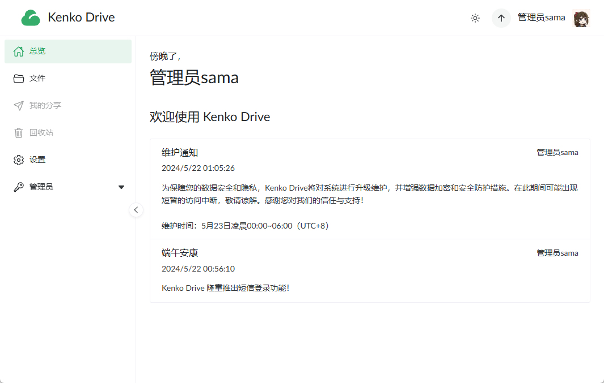

# KenkoDrive 我的云盘

[](https://github.com/AkagiYui/KenkoDrive?tab=readme-ov-file#MIT-1-ov-file)

[](https://github.com/AkagiYui/KenkoDrive/commits/)
[](https://github.com/AkagiYui/KenkoDrive/commits/)

[](https://github.com/AkagiYui/KenkoDrive/actions/workflows/test.yml)
[](https://github.com/AkagiYui/KenkoDrive/stargazers)
[](https://codecov.io/gh/AkagiYui/KenkoDrive)

一个基于 `SpringBoot 3.2`、`Spring Security`、`Gradle 8.7` 和 `JPA` ，使用 `Kotlin` 编写的 Web 云盘应用单体后端。
项目整体结构清晰，职责明确，注释全面，开箱即用。

> [!IMPORTANT]
> 该项目仅为个人学习项目，不具备商业使用价值，仅供学习交流。
> 如果你需要一款类似的软件，不妨看看[alist](https://github.com/alist-org/alist)。

> [!CAUTION]
> 该项目仍处于初期开发阶段，数据库结构将会频繁变动，不建议在生产环境中使用，请注意备份数据。

|      相关       |                                                                          链接                                                                          |
|:-------------:|:----------------------------------------------------------------------------------------------------------------------------------------------------:|
|   GitHub仓库    |                                       [github.com/AkagiYui/KenkoDrive](https://github.com/AkagiYui/KenkoDrive)                                       |
| GitLink中国大陆仓库 |                                   [gitlink.org.cn/AkagiYui/KenkoDrive](https://gitlink.org.cn/AkagiYui/KenkoDrive)                                   |
|    在线演示地址     | [drive.akagiyui.com](https://drive.akagiyui.com) |
|    API 文档     |                                                [kenkodrive.apifox.cn](https://kenkodrive.apifox.cn/)                                                 |
|     前端仓库      |                [KenkoDriveVue](https://github.com/AkagiYui/KenkoDriveVue) / [中国大陆镜像仓库](https://gitlink.org.cn/AkagiYui/KenkoDriveVue)                |

## 截屏




## 业务功能一览

- [x] 用户(邮箱)注册；(短信/用户名/邮箱)登录
- [x] 个人信息设置、头像上传、密码重置
- [x] 文件(夹)上传/下载/删除
- [ ] 文件分享
- [ ] 游客广场
- [x] 管理员用户管理
- [ ] 管理员文件管理
- [ ] 文件搜索
- [ ] 文件内容检索
- [ ] 照片地理位置统计
- [ ] 用户登录地理位置统计
- [ ] 文件类型统计
- [ ] 流量统计
- [ ] 在线解压
- [ ] 批量打包下载
- [ ] 敏感内容审查
- [ ] (图片、视频、音频封面)缩略图生成
- [ ] 系统告警通知
- [ ] 第三方登录
- [ ] 增值服务
- [ ] 回收站
- [ ] 文件收藏
- [ ] 大文件清理
- [ ] 重复文件清理
- [ ] 文档在线编辑
- [ ] 图片内容识别
- [ ] 离线下载
- [ ] 文件同步
- [ ] 文件版本管理
- [ ] 文档协作

### 文件快递柜

- [ ] 匿名分享：无需注册，直接分享
- [ ] 支持多种类型：文本，图片，文件
- [ ] 随机取件码生成
- [ ] 自定义次数、有效期

## 相关技术一览

- [x] [请求频率限制(注解 + 令牌桶)](app/src/main/kotlin/com/akagiyui/drive/component/limiter/FrequencyLimitAspect.kt)
- [x] [下载速度限制](app/src/main/kotlin/com/akagiyui/common/BucketManager.kt)
- [x] [异步任务](app/src/main/kotlin/com/akagiyui/drive/service/MailService.kt)
- [x] [邮件发送](app/src/main/kotlin/com/akagiyui/drive/service/MailService.kt)
- [x] [参数校验](app/src/main/kotlin/com/akagiyui/drive/model/request/user/AddUserRequest.kt)
- [x] [权限校验](app/src/main/kotlin/com/akagiyui/drive/model/Permission.kt)
- [x] [统一 JSON 格式返回](app/src/main/kotlin/com/akagiyui/common/ResponseResult.kt)
- [ ] [日志记录](app/src/main/kotlin/com/akagiyui/drive/component/DatabaseLogAppender.kt)
- [x] [速度限制、流量限制](app/src/main/kotlin/com/akagiyui/drive/controller/FileController.kt)
- [x] 验证码(CAPTCHA): [图片验证码](app/src/main/kotlin/com/akagiyui/drive/service/CaptchaService.kt)、
  [极验行为验证码](app/src/main/kotlin/com/akagiyui/drive/component/captcha/GeetestCaptchaV4Aspect.kt)
- [x] 一次性密码(OTP): [邮箱验证码](app/src/main/kotlin/com/akagiyui/drive/service/impl/MailServiceImpl.kt)、
  [阿里云短信验证码](app/src/main/kotlin/com/akagiyui/drive/service/impl/SmsServiceImpl.kt)
- [x] [断点续传](app/src/main/kotlin/com/akagiyui/drive/controller/FileController.kt)
- [ ] [分片上传](app/src/main/kotlin/com/akagiyui/drive/service/UploadService.kt)
- [x] [分片下载](app/src/main/kotlin/com/akagiyui/drive/controller/FileController.kt)
- [ ] 文件秒传
- [x] [相同文件合并(上传时检测)](app/src/main/kotlin/com/akagiyui/drive/service/impl/UploadServiceImpl.kt)
- [x] [Gotify 消息推送](app/src/main/kotlin/com/akagiyui/common/notifier/GotifyPusher.kt)
- [x] [定时任务](app/src/main/kotlin/com/akagiyui/drive/task/CronTasks.kt)
- [ ] OAuth2.0
- [ ] 对接支付宝
- [ ] Gravatar / Cravatar 头像

## 技术栈

[](https://kotlinlang.org/)
[](https://gradle.com/)
[](https://spring.io/projects/spring-boot)
[](https://spring.io/projects/spring-boot)
[](https://spring.io/projects/spring-data-jpa)
[](https://www.mysql.com/)
[](https://redis.io/)
[](https://www.docker.com/)
[](https://www.drone.io/)
[](https://min.io/)

- [x] [Gradle 包管理](build.gradle.kts)
- [x] [Spring Boot 3.2](app/src/main/kotlin/com/akagiyui/drive/KenkoDriveApplication.kt)
- [x] [Spring Security（跨域与认证授权）](app/src/main/kotlin/com/akagiyui/drive/config/SecurityConfig.kt)
- [x] MySQL 数据库
- [x] [Spring Cache 缓存](app/src/main/kotlin/com/akagiyui/drive/config/CacheConfig.kt)
- [x] [Caffeine 本地缓存](app/src/main/kotlin/com/akagiyui/drive/config/CacheConfig.kt)
- [x] [Redis 缓存](app/src/main/kotlin/com/akagiyui/drive/component/RedisCache.kt)
- [ ] [多级缓存](https://github.com/pig-mesh/multilevel-cache-spring-boot-starter)
- [x] [JWT 鉴权](app/src/main/kotlin/com/akagiyui/common/token/TokenTemplate.kt)
- [x] [Docker 容器化部署](docker-compose.yaml)
- [x] [Drone CI/CD 自动化部署](.drone.yml)
- [x] [JPA ORM 框架](app/src/main/kotlin/com/akagiyui/drive/repository)
- [x] AOP 切面：[频率控制](app/src/main/kotlin/com/akagiyui/drive/component/limiter/FrequencyLimitAspect.kt)、
  [权限校验](app/src/main/kotlin/com/akagiyui/drive/component/permission/PermissionCheckAspect.kt)、
  [请求日志](app/src/main/kotlin/com/akagiyui/drive/component/RequestLogAspect.kt)
- [x] [ApiFox 在线 API 文档](#kenkodrive-我的云盘)
- [x] [Minio 对象存储](app/src/main/kotlin/com/akagiyui/drive/config/MinioConfig.kt)
- [ ] 阿里云 OSS 对象存储
- [ ] WebDAV
- [ ] 搜索引擎
- [x] 事务管理
- [x] [WebSocket](app/src/main/kotlin/com/akagiyui/drive/controller/persist/MemoryWebSocketHandler.kt)
- [x] [SSE(Server-Sent Events)](app/src/main/kotlin/com/akagiyui/drive/controller/persist/MemorySseController.kt)

## RoadMap

|        需求        | 状态  |    完成时间    |
|:----------------:|:---:|:----------:|
|      前端自动部署      | 已完成 | 2023年6月1日  |
|      后端自动部署      | 已完成 | 2023年6月26日 |
|     用户注册/登录      | 已完成 | 2023年7月25日 |
|      用户权限校验      | 已完成 | 2023年8月15日 |
|      断点续传下载      | 已完成 | 2023年8月19日 |
|    升级到Java21     | 已完成 | 2024年4月14日 |
| 升级到SpringBoot3.2 | 已完成 | 2024年4月14日 |

## 活跃数据


## 部署运行

后端暴露端口默认为 `6677` 。

### 使用 Docker Compose 部署

注意：该方法会使用 Dockerfile 进行容器的本地构建。

```shell
git clone https://github.com/AkagiYui/KenkoDrive
cd KenkoDrive
docker compose -p kenko-drive -f docker-compose.yaml up -d
```

### 从源码运行

你需要拥有 JDK 21 环境，并且安装有 MySQL 8，Redis 7 与 Minio 。
默认将启动 `prod` 配置，你可以修改 `.env.yaml` 或其他配置文件中修改数据库地址等信息。

```shell
git clone https://github.com/AkagiYui/KenkoDrive
cd KenkoDrive
./gradlew bootRun
```

## 鸣谢

- [Drone官方文档](https://docs.drone.io/)
- [Spring官方文档: CORS](https://docs.spring.io/spring-security/reference/servlet/integrations/cors.html)
- [Spring官方文档: Building web applications with Spring Boot and Kotlin](https://spring.io/guides/tutorials/spring-boot-kotlin)
- [Kotlin官方文档: Lombok compiler plugin](https://kotlinlang.org/docs/lombok.html)
- [GitHub官方文档: 创建 Redis 服务容器](https://docs.github.com/zh/actions/using-containerized-services/creating-redis-service-containers)
- [柏码知识库](https://itbaima.net/document)
- [在 Kotlin 中使用 SLF4J](https://flapypan.top/notes/kotlin#%E5%9C%A8-kotlin-%E4%B8%AD%E4%BD%BF%E7%94%A8-slf4j)
- [Spring Boot JPA 打印 SQL 语句及参数](https://www.zhangbj.com/p/1411.html)
- [Spring 框架缓存故障自动切换](https://kyon.life/post/dynamic-switch-cache-in-spring/)
- [Auto-accepting terms of service with Gradle build scans](https://www.yellowduck.be/posts/auto-accepting-terms-of-service-with-gradle-build-scans/)
- [【DB系列】JPA之update使用姿势](https://spring.hhui.top/spring-blog/2019/06/23/190623-SpringBoot%E7%B3%BB%E5%88%97%E6%95%99%E7%A8%8BJPA%E4%B9%8Bupdate%E4%BD%BF%E7%94%A8%E5%A7%BF%E5%8A%BF/)
- [Contract，开发者和 Kotlin 编译器之间的契约](https://droidyue.com/blog/2019/08/25/kotlin-contract-between-developers-and-the-compiler/)
- [GitHub: Improve CVE-2023-34035 detection](https://github.com/spring-projects/spring-security/issues/13568)
- [Stack Overflow: How to intercept a RequestRejectedException in Spring?](https://stackoverflow.com/a/75338927/19990931)
- [Stack Overflow: Map enum in JPA with fixed values?](https://stackoverflow.com/questions/2751733/map-enum-in-jpa-with-fixed-values)
- [Stack Overflow: Are many-to-many relationships possible with enums in JPA or Hibernate?](https://stackoverflow.com/questions/39870914/are-many-to-many-relationships-possible-with-enums-in-jpa-or-hibernate)
- [Stack Overflow: Proper way of streaming using ResponseEntity and making sure the InputStream gets closed](https://stackoverflow.com/questions/51845228/proper-way-of-streaming-using-responseentity-and-making-sure-the-inputstream-get)
- [Medium: Partial Data Retrieval in Spring Boot REST API](https://medium.com/@bubu.tripathy/partial-data-retrieval-in-spring-boot-rest-api-b62b7a0cae34)
- [Baeldung: Rate Limiting a Spring API Using Bucket4j](https://www.baeldung.com/spring-bucket4j)
- [腾讯云开发者社区: 将构建配置从 Groovy 迁移到 KTS](https://cloud.tencent.com/developer/article/1839887?from=15425)
- [博客园: docker-compose重新启动单个容器](https://www.cnblogs.com/yakniu/p/16982310.html)
- [博客园: SpringBoot应用程序使用Gradle配置脚本中的版本号](https://www.cnblogs.com/xupeixuan/p/15695652.html)
- [博客园: Java下载文件，中文名乱码（attachment;filename=中文文件名）](https://www.cnblogs.com/tomcatandjerry/p/11541871.html)
- [博客园: SpringBoot中logback.xml使用application.yml中属性](https://www.cnblogs.com/jianliang-Wu/p/8945343.html)
- [掘金: SpringBoot实现固定、动态定时任务 | 三种实现方式](https://juejin.cn/post/7013234573823705102)
- [掘金: SpringData JPA条件查询、排序、分页查询](https://juejin.cn/post/6985573675764285477)
- [慕课手记: Spring AOP中AspectJ切入点表达式的巧妙利用](https://www.imooc.com/article/details/id/297283)
- [脚本之家: springboot切换使用undertow容器的方式](https://www.jb51.net/article/254623.htm)
- [知乎: SpringBoot开始定时任务的三种方式](https://zhuanlan.zhihu.com/p/622930121)
- [知乎: ObjectMapper，别再像个二货一样一直new了！](https://zhuanlan.zhihu.com/p/498705670)
- [知乎: 基于 HTTP Range 实现文件分片并发下载！](https://zhuanlan.zhihu.com/p/620113538)
- [哔哩哔哩: 【java工程师必知】SpringBoot Validation入参校验国际化](https://www.bilibili.com/video/av742302746/)
- [哔哩哔哩: 嘿嘿，我发现了百度网盘秒传的秘密！](https://www.bilibili.com/video/av1751974636)
- [哔哩哔哩: 【IT老齐508】二十分钟快速上手Gradle](https://www.bilibili.com/video/av1602972088)
- [哔哩哔哩: 【IT老齐509】巧用Docker Container网络模式让应用更易维护](https://www.bilibili.com/video/av1302980032)
- [CSDN: 有关HikariPool-1 – Failed to validate connection com.mysql.cj.jdbc.ConnectionImp 错误的产生原因与解决方法](https://blog.csdn.net/qq_45886144/article/details/128984915)
- [CSDN: 数据库连接池选型 Druid vs HikariCP性能对比](https://blog.csdn.net/weixin_39098944/article/details/109228618)
- [CSDN: SpringBoot 使用 beforeBodyWrite 实现统一的接口返回类型](https://blog.csdn.net/qq_37170583/article/details/107470337)
- [CSDN: Jpa设置默认值约束](https://blog.csdn.net/github_38336924/article/details/107153217)
- [CSDN: gradle通过def定义变量指定依赖版本](https://blog.csdn.net/qq_36666651/article/details/80718761)
- [CSDN: 踩坑：springboot邮箱发送邮件，JavaMailSender自动注入失败的问题](https://blog.csdn.net/A15517340610/article/details/103764245)
- [CSDN: 解决JPA的枚举局限性](https://blog.csdn.net/listeningsea/article/details/122149580)
- [CSDN: springboot 配置 Validator 校验框架国际化 支持快速返回](https://blog.csdn.net/weixin_40461281/article/details/121597834)
- [CSDN: spring常见错误【数据库】idleTimeout is close to or more than maxLifetime, disabling it.](https://blog.csdn.net/qq_26462567/article/details/123982879)
- [CSDN: spring.jpa.open-in-view is enabled by default. Therefore, database queries may be performed during v](https://blog.csdn.net/jj89929665/article/details/111387865)
- [CSDN: 大文件上传下载实现思路，分片、断点续传代码实现，以及webUpload组件](https://blog.csdn.net/weixin_52210557/article/details/124097574)
- [CSDN: kotlin 中的open关键字](https://blog.csdn.net/weixin_42600398/article/details/114486754)
- [CSDN: 在SpringBoot中使用AOP获取HttpServletRequest、HttpSession 内容](https://blog.csdn.net/fishinhouse/article/details/79896971)
- [CSDN: 【spring boot - JPA--H2报错】H2 error: “Syntax error in SQL statement ... expected identifier“](https://blog.csdn.net/wondersfan/article/details/126631804)
- [CSDN: 前端 ts 使用枚举爆红 元素隐式具有 “any“ 类型，因为索引表达式的类型不为 “number“,根据名字获取数字，根据数字获取字符](https://blog.csdn.net/weixin_45973327/article/details/131985139)
- [CSDN: 【进阶】logback之 AsyncAppender 的原理、源码及避坑建议](https://blog.csdn.net/BASK2312/article/details/128504636)
- [CSDN: JPA不用@Repository--笔记](https://blog.csdn.net/zero_cctv/article/details/109322211)
- [CSDN: java发送邮件](https://blog.csdn.net/lv_zj/article/details/134037631)
- [CSDN: springboot集成websocket报错Are you running in a Servlet container that supports JSR-356?](https://blog.csdn.net/gz_jax/article/details/120327900)
- [CSDN: @Scheduled注解简介](https://blog.csdn.net/weixin_52255395/article/details/126952819)
- [简书: Spring Boot - 数据校验](https://www.jianshu.com/p/e69a1f187482)
- [简书: java 修改HttpServletRequest的参数或请求头](https://www.jianshu.com/p/a8c9d45775ea)
