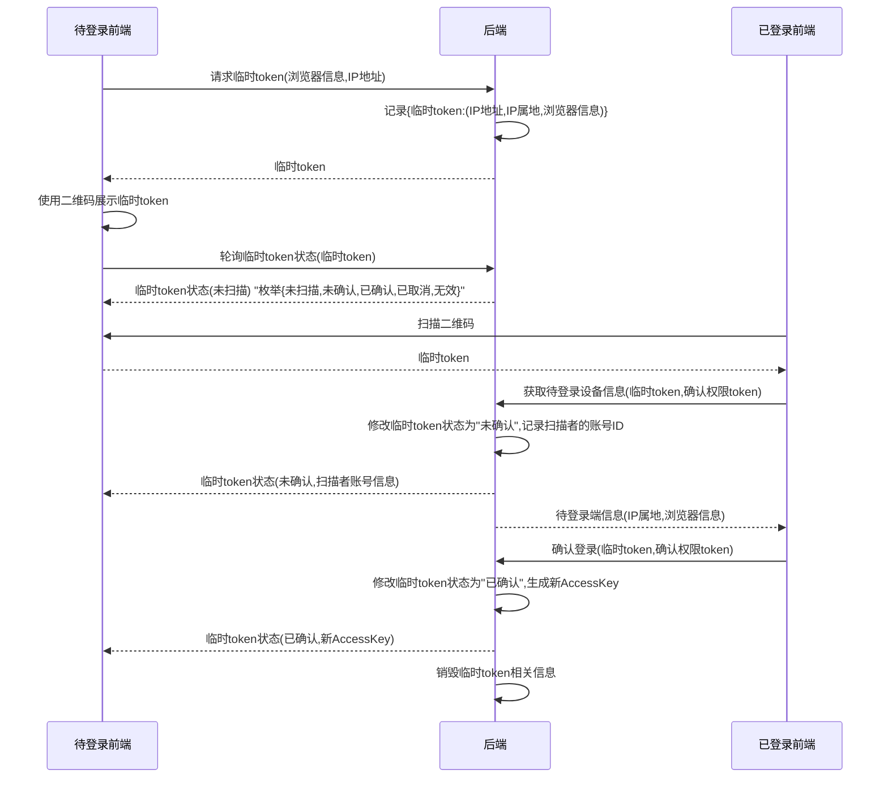

# 项目开发规范

## Controller层

Controller层方法直接返回业务数据，
包装将由`ResponseBodyAdvice`统一处理。

## 二维码登录

- 临时token：用于索引本次登录的任务
- 确认权限token：保证只有扫描者才能进行确认操作

## 命名规范

### 方法名必须表明意图

- ❌`find()`
- ✅`findUser()`

### Service中不要使用`find`

- ❌`userService.findUser()`
- ✅`userService.getUser()`
