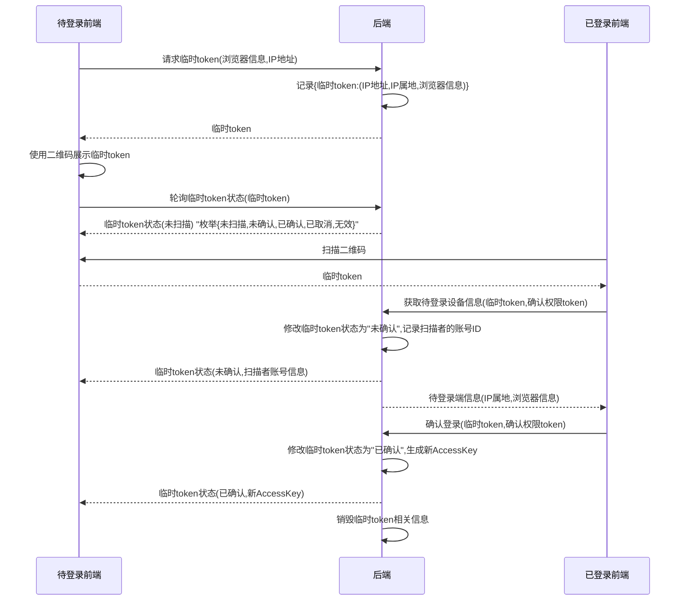

# 项目开发规范

此文档排序较乱，待整理。
如果你希望参与开发，请遵循以下规范。
如对该规范有疑问或建议，请在issue讨论。

## 用户属性

| 属性  | 类型   | 不可修改 | 唯一 | 可空 | 描述                         |
|-----|------|------|----|----|----------------------------|
| ID  | 雪花ID | 是    | 是  |    | 系统自动生成，用于在系统中唯一标识用户，不可用于登录 |
| 用户名 | 字符串  | 是    | 是  |    | 用于唯一标识用户，可用于登录             |
| 昵称  | 字符串  |      |    |    | 用于展示                       |
| 密码  | 字符串  |      |    | 是  | 不为空时用于登录                   |
| 邮箱  | 字符串  |      |    | 是  | 用于找回密码，不为空时可用于登录           |
| 手机号 | 字符串  |      |    | 是  | 用于找回密码，不为空时可用于登录           |

## Controller层

Controller层方法**直接**返回业务数据，
包装将由`ResponseBodyAdvice`统一处理。

## 权限控制

本系统权限控制使用RBAC模型，其中`权限`被硬编码在系统中 ，
`角色`和`用户`由用户管理模块管理。
权限校验应当只检查是否拥有权限，不应该检查是否是某个角色。

## 二维码登录

- 临时token：用于索引本次登录的任务
- 确认权限token：保证只有扫描者才能进行确认操作

## 命名规范

### 方法名必须表明意图

- ❌`find()`
- ✅`findUser()`

### Service中不要使用`find`

- ❌`userService.findUser()`
- ✅`userService.getUser()`
